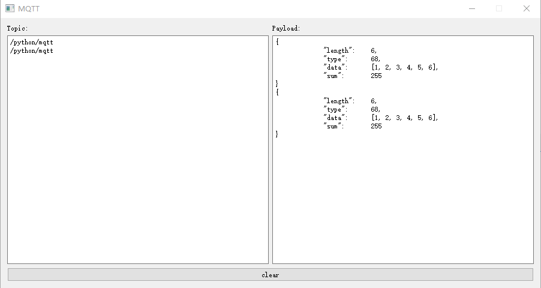

# MQTT上位机

## 环境配置

1. pyQt5
2. paho-mqtt
3. json

## 使用方法

1. 确保配置好[mqtt服务器](https://docs.emqx.cn/cn/broker/latest/getting-started/install.html)，并连接网络。

2. 修改`setting.json`文件中的服务器配置信息，然后运行：

   ```shell
   python app.py
   ```

3. 等待art-pi上传数据。

