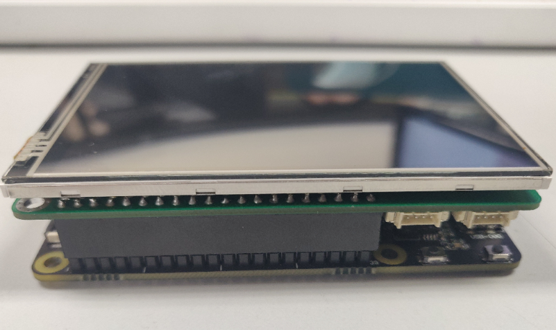

# 远程调试终端

## 简介

本设计实现了一个远程调试助手，ART-Pi接收到无线串口按一定协议发送的数据后，将数据解析并打包为json格式发送给订阅该话题的**MQTT上位机**。

搭配**ART-Pi Mate**可实现多种通信接口的调试，但由于时间有限，只实现了其中一种。

## 所需硬件
1. ART-Pi*1
2. ART-Pi Mate*1
3. 无线数传*2(一片焊接在ART-Pi Mate上作为接收端，一片作为发送端连接到PC机的USB口)

## 软件说明

### wifi配置

源码位于`modules/wifi`中，该模块实现启动时的联网任务。

### mqtt配置

源码位于`modules/mqtt_client`中，实现mqtt通信相关操作。

### 主要程序

该软件的主要代码位于`applications/terminal.c`中，主要完成功能有

1. 对串口的初始化
2. 以状态机的方式解析串口数据
3. 打包json数据
4. 发送MQTT话题

其中数据协议定义如下：


json数据打包如下：

```json
{
        "length":       6,
        "type": 68,
        "data": [1, 2, 3, 4, 5, 6],
        "sum":  255
}

```


## 运行

### 编译&下载

编译完成后，将开发板的 ST-Link USB 口与 PC 机连接，然后将固件下载至开发板。


### 运行

确保wifi的ssid以及passwd设置正确后，在终端执行`terminal_init`即可。



